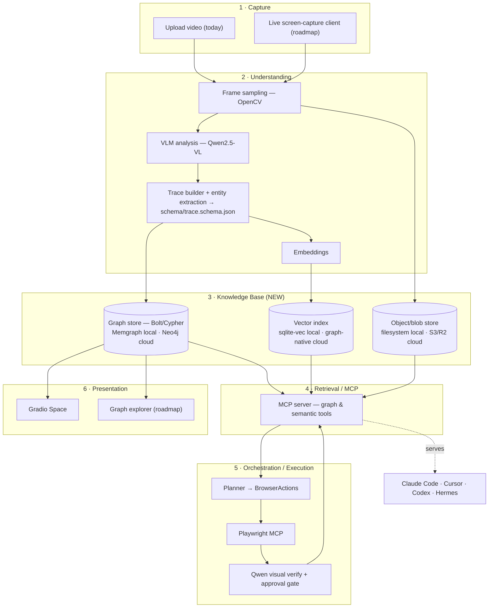
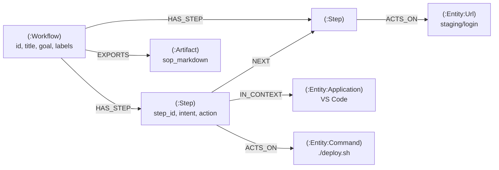

# Gofer Trace — Architecture

**Multimodal workflow memory for AI agents.** A screen recorder captures how real
human work happens; Gofer Trace turns that recording into structured, queryable
**workflow memory** in a knowledge graph, and serves it to any agent (Claude Code,
Cursor, Codex, Hermes) over MCP.

This document describes the **target architecture** and how it maps onto — and grows
out of — what exists in the repo today. It is deliberately incremental: every phase
leaves the app working. For the ordered task list see [ROADMAP.md](./ROADMAP.md).

---

## 1. Where we are today

The MVP (AMD Developer Hackathon) is a linear pipeline:

```
Gradio Space (space/app.py)
  → POST /upload            backend/main.py            store MP4
  → POST /analyze/{id}      video_processing.py         OpenCV frame sampling
                            model_client.py             Qwen2.5-VL-7B (or heuristic stub)
                            trace_builder.py            flat JSON  →  data/traces/{id}.json
  → GET  /trace, /ask, /sop                             Q&A / SOP over the flat JSON
MCP (agent/mcp_server.py)   → wraps the HTTP API as tools for Claude Code / Cursor
Execution (planner.py)      → trace steps → Playwright BrowserActions → Qwen visual verify
```

**What's solid:** the capture→frames→VLM→steps pipeline, the MCP tool surface, the
human-in-the-loop `review_plan → approve_plan → verify_step` execution gate.

**What blocks the vision (the two real gaps):**

1. **No knowledge base.** "Memory" is a folder of disconnected `data/traces/*.json`
   files. There is no graph, no schema, no entities, no semantic search, and no way for
   an agent to ask *"have I seen a workflow that does X?"* across recordings.
   `list_workflows()` in the MCP server literally can't list workflows — it returns
   guidance text.
2. **No local/cloud split.** The backend URL `http://134.199.204.12:8001` is hardcoded
   in `.mcp.json`, `.cursor/mcp.json`, `space/app.py`, and `agent/mcp_server.py`. There
   is one deployment, and it's someone's dev box IP.

Everything below closes those two gaps without throwing away the pipeline.

---

## 2. Target architecture

Six layers. The **Knowledge Base** and the **profile/config seam** are the new load-bearing
pieces; the rest already exist and get refactored behind interfaces.



### 2.1 Capture
Produces a recording (+ optional event stream). Today: MP4 upload through the Gradio
Space. Roadmap: a lightweight local capture client that records the screen and, where
available, active-window / URL / input metadata to make understanding far more accurate
than pixels alone.

### 2.2 Understanding
Unchanged pipeline, one addition: after the VLM produces per-frame analysis, an
**entity-extraction + normalization** pass emits the `entities[]` and structured
`action{}` fields defined in [`schema/trace.schema.json`](../schema/trace.schema.json),
and an **embedding** pass produces per-step vectors. Output is always a schema-valid
trace — never persisted unless it validates.

### 2.3 Knowledge Base — the new core
Three stores behind **one interface** (`KnowledgeBase`, see §4):

- **Graph** — the workflow knowledge graph (§3). Bolt protocol + Cypher, so the *same
  adapter* runs **Memgraph** (local: in-memory, one Docker container) or **Neo4j /
  AuraDB** (cloud: managed). This is the decision that dissolves "Memgraph *or* Neo4j."
- **Vector index** — per-step / per-workflow embeddings for semantic retrieval.
  `sqlite-vec` (or FAISS) locally; the graph engine's native vector index in cloud.
- **Blob store** — videos, frames, exported artifacts. Local filesystem vs. S3/R2.

### 2.4 Retrieval / MCP
The MCP server stops being a thin HTTP proxy and becomes the **query brain**: graph
traversals + semantic search + artifact export, exposed as tools (§5). This is the
single surface every external agent consumes.

### 2.5 Orchestration / Execution
Unchanged: `planner.py` turns a workflow into `BrowserAction`s, Playwright MCP executes,
Qwen visual-verifies each step, and the `approve_plan` gate keeps a human in the loop.
The only upgrade: the planner reads the structured `action{}` field from the schema
instead of keyword-guessing.

### 2.6 Presentation
The Gradio Space stays as the demo/analysis UI. A read-only **graph explorer** is a
natural roadmap add once the KB exists.

---

## 3. Graph model

Traces map to the graph mechanically — every object in `trace.schema.json` is a node or
edge. Shared `:Entity` nodes are what turn a pile of recordings into connected memory:
two workflows that both run `./deploy.sh` link through the same `:Entity {command}`.



**Nodes:** `:Workflow`, `:Step`, `:Entity` (with a sub-label per `entity.type`:
`:Application`, `:File`, `:Url`, `:Command`, …), `:Artifact`.

**Edges:** `HAS_STEP` (Workflow→Step), `NEXT` (Step→Step, execution order), `ACTS_ON`
(Step→Entity), `IN_CONTEXT` (Step→Entity application), `EXPORTS` (Workflow→Artifact).
Add `SIMILAR_TO` (Workflow↔Workflow) later from embedding similarity for
"related workflows."

Because the model is plain Cypher, the schema constraints and all queries are identical
on Memgraph and Neo4j:

```cypher
// Constraints (run once per DB)
CREATE CONSTRAINT workflow_id IF NOT EXISTS FOR (w:Workflow) REQUIRE w.id IS UNIQUE;
CREATE CONSTRAINT entity_id   IF NOT EXISTS FOR (e:Entity)   REQUIRE e.id IS UNIQUE;

// "Find workflows that touch this command" — cross-recording retrieval an agent asks for
MATCH (w:Workflow)-[:HAS_STEP]->(:Step)-[:ACTS_ON]->(e:Entity {type:'command'})
WHERE e.value CONTAINS 'deploy'
RETURN DISTINCT w.id, w.title, w.goal;
```

---

## 4. The interface seam (why one codebase serves both profiles)

Two small abstractions make local and cloud the *same code with different settings*,
and kill the hardcoded IP:

```python
# settings.py — one source of truth, env-driven
class Settings:
    profile: Literal["local", "cloud"]   # GOFER_PROFILE
    api_base: str                        # replaces the hardcoded 134.199.204.12
    graph_url: str                       # bolt://localhost:7687  |  neo4j+s://...aura...
    vlm: str                             # local model id / stub  |  remote endpoint
    blob_root: str                       # ./data                 |  s3://gofer-...

# knowledge_base.py — the storage seam every layer talks to
class KnowledgeBase(Protocol):
    def put_trace(self, trace: dict) -> None: ...          # validate + upsert graph + index
    def get_workflow(self, workflow_id: str) -> dict: ...
    def list_workflows(self) -> list[dict]: ...            # finally makes MCP list_workflows real
    def search(self, query: str, k: int = 5) -> list[dict]: ...   # semantic + graph
    def similar_steps(self, workflow_id: str, step_id: int) -> list[dict]: ...
```

Implementations:

| | **Local profile** | **Cloud profile** |
|---|---|---|
| `GOFER_PROFILE` | `local` | `cloud` |
| Understanding | Qwen2.5-VL-3B/7B on local GPU, or heuristic stub (no GPU) | Qwen2.5-VL-7B on **AMD MI300X** (existing) or hosted VLM endpoint |
| `KnowledgeBase` | `GraphKnowledgeBase(bolt=localhost)` → **Memgraph** container | `GraphKnowledgeBase(bolt=aura)` → **Neo4j AuraDB** |
| Vector index | `sqlite-vec` / FAISS on disk | graph-native vector index |
| Blob store | local filesystem (`data/`) | S3 / Cloudflare R2 |
| Bring-up | `docker compose up` (backend + Memgraph) | Terraform / container deploy + managed graph |
| Auth | none (single user) | API keys / OAuth, per-user workflow scoping |

`GraphKnowledgeBase` is a **single** class targeting Bolt+Cypher — the only difference
between profiles is the connection URL and credentials.

---

## 5. MCP surface (what agents actually call)

The MCP server is the product boundary for Claude Code, Cursor, Codex, and Hermes.
Current tools stay; the KB unlocks the retrieval tools that make cross-workflow memory
useful. Everything is transport-agnostic MCP, so the same server drops into each agent's
config (`.mcp.json`, `.cursor/mcp.json`, Codex/Hermes equivalents).

| Tool | Status | Notes |
|---|---|---|
| `list_workflows()` | **fix** | Return real workflows from `KnowledgeBase.list_workflows()` (today it returns guidance text). |
| `search_workflows(query)` | **new** | Semantic + graph search — the headline capability. "Find a workflow that deploys to staging." |
| `load_workflow(id)` | keep | Already returns a good markdown context block. |
| `get_step_context(id, step)` | **new** | Neighborhood of a step: entities touched, prev/next, similar steps. |
| `find_similar_steps(id, step)` | **new** | Vector search across all recordings. |
| `export_sop(id)` | keep | Persist as a first-class `:Artifact`. |
| `get_execution_plan` / `review_plan` / `approve_plan` / `verify_step` / `mark_step_complete` | keep | Execution + human-in-the-loop gate, unchanged. |
| `ask_workflow(id, q)` | keep | Q&A over a single trace. |

---

## 6. Security & privacy (screen recordings are sensitive)

Recordings routinely contain tokens, PII, and internal URLs. Design constraints baked
into the schema and layers:

- **Never store secrets in a trace.** `entity.type: "credential_ref"` is a *reference*,
  not a value. Add a redaction pass in Understanding before persistence.
- **Local profile is fully offline-capable** — no recording or trace leaves the machine;
  Memgraph and the VLM both run locally. This is the privacy story for the OSS default.
- **Cloud profile** needs per-user scoping on every graph query, encrypted blob storage,
  and signed URLs for frame/video access.

---

## 7. How this maps back to the repo

| Target piece | Lives in / becomes |
|---|---|
| `schema/trace.schema.json` | **added** — the contract (this PR) |
| `settings.py` (profile/config) | new module; replaces hardcoded `134.199.204.12` in 4 files |
| `KnowledgeBase` interface | new module; `FileKnowledgeBase` (wraps today's JSON) → `GraphKnowledgeBase` |
| Entity extraction + `action{}` | extends `trace_builder.py` |
| Embeddings + vector index | extends Understanding; new dependency |
| Graph adapter | new module (`neo4j` Python driver, works for both engines) |
| MCP retrieval tools | extends `agent/mcp_server.py` |
| `docker-compose.yml` | **added** — local backend + Memgraph one-liner |
| Planner reads `action{}` | small change in `planner.py` |

See [ROADMAP.md](./ROADMAP.md) for the phased, acceptance-criteria'd task list.
